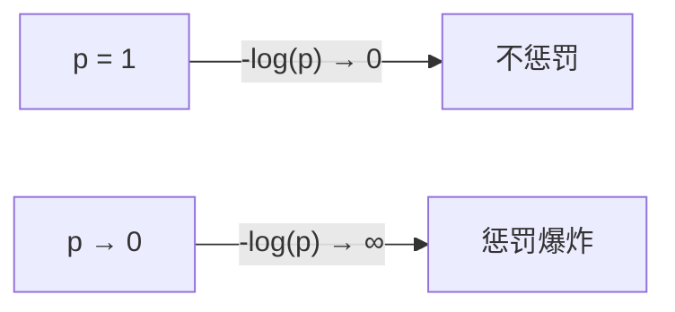

# 2. 神经网络基础与原理

> 本文只回答一个问题：**神经网络到底是怎么"学"的？**
>
> 全篇只有一条主线，所有概念都是为它服务的：
>
> ```
> 加权求和 → 加非线性 → 衡量误差 → 求梯度 → 改参数 → 回到第一步
> ```
>
> 看不懂某个概念时，回到这条主线问一句："它是这五步里的哪一步？"基本就能定位。
>
> 文中的数字都可以用 `2_neural_network.py` 复现；第 7 节反向传播的手算例子是手工设计的（便于一步步跟算），其中的梯度已用数值微分交叉校验过。

---

## 0. 先看要解决的问题，再看工具

不先看例子就讲"神经元""权重"很容易云里雾里。代码第 4 节构造了这样一份数据（`np.random.seed(42)`，结果可复现）：

- **类别 A**（标签 1）：100 个点，围绕 (2, 2) 随机分布
- **类别 B**（标签 0）：100 个点，围绕 (-2, -2) 随机分布

```
   ▲ x2
 3 |              ● ● ●
 2 |            ● ● ● ● ●          ← 类别 A (标签 1)
 1 |           ● ● ● ●
 0 |
-1 |        ○ ○ ○ ○                ← 类别 B (标签 0)
-2 |      ○ ○ ○ ○ ○
-3 |    ○ ○ ○
   +----------------------------► x1
```

任务就是：**输入一个点的坐标 (x1, x2)，输出它属于哪一类**。

人一眼就能看出"左上角的是 A，右下角的是 B"，但计算机只看到两列数字。神经网络要做的事，就是**从 200 个 (x1, x2, 标签) 的样本里，自己把这条分界线找出来**——没有告诉它"看左上角"，它自己学。

后面所有东西（权重、激活函数、损失、反向传播）都是为这一件事服务的。

---

## 1. 从生物神经元到人工神经元

生物神经元的工作方式：**树突接收信号 → 细胞体汇总处理 → 超过阈值就沿轴突发放信号**。

人工神经元完全照抄这个逻辑，只做了三件事：

```
        x1 ──(w1)──┐
        x2 ──(w2)──┼──► Σ ──► +b ──► f(·) ──► 输出
        x3 ──(w3)──┘    加权求和   偏置    激活
```

| 生物概念 | 人工对应 | 干什么的 |
|---|---|---|
| 树突接收信号 | 输入 x | 原始数据（像素、坐标……） |
| 突触强度 | 权重 w | **可调**，决定这个输入有多重要 |
| 阈值 | 偏置 b | **可调**，决定"门槛"高低 |
| 是否发放信号 | 激活函数 f | 决定输出什么、要不要压扁 |
| 轴突输出 | 输出 | 传给下一层 |

一句话：**权重和偏置是模型唯一要学的东西**（另外两个是固定的运算规则）。训练的全部工作，就是在调 w 和 b。

公式：

```
z = w₁x₁ + w₂x₂ + ... + wₙxₙ + b = Wx + b        ← 线性部分
a = f(z)                                          ← 非线性部分
```

---

## 2. 手算一次：单个神经元的前向传播

不用任何框架，纸笔就能算。代码第 1 节的例子：

```
输入   x = [1.0, 2.0, 3.0]
权重   w = [0.5, -0.3, 0.8]
偏置   b = 0.1
```

**第一步：加权求和**

```
z = 0.5×1.0 + (-0.3)×2.0 + 0.8×3.0 + 0.1
  = 0.5     - 0.6        + 2.4       + 0.1
  = 2.40
```

**第二步：过激活函数**（注意：这一步用的是同一个 z，换了函数输出就完全不同）

```
过 ReLU    = max(0, 2.40)          = 2.40
过 Sigmoid = 1 / (1 + e^(-2.40))   = 0.9168
```

对照真实运行输出：

```
线性输出 z = w·x + b = 2.40
过 ReLU    = 2.40
过 Sigmoid = 0.9168
```

**这就是"前向传播"（forward）的全部内容**：一层一层这么算下去，直到得到输出。它没有学习、没有魔法，纯粹是代入公式。

> 直觉理解 `w` 和 `b`：`w` 是"每个输入的分量有多重"，`b` 是"不输入任何东西时这个神经元自己的倾向"。`z = 2.40` 的意思是"这个神经元收到的总信号强度是 2.40"，正的表示倾向于"激活"。

---

## 3. 感知机：一个神经元的能力边界

**单层感知机**就是上面这个神经元直接输出：

```
y = f(w₁x₁ + w₂x₂ + b)
```

它在几何上做的事情是：**用一条直线（高维是超平面）把空间切成两半**。

$$w_1x_1 + w_2x_2 + b = 0$$

这解释了它的局限——**只能处理"线性可分"的问题**。最经典的失败例子是 XOR（异或）：

| x1 | x2 | XOR 输出 |
|---|---|---|
| 0 | 0 | 0 |
| 0 | 1 | 1 |
| 1 | 0 | 1 |
| 1 | 1 | 0 |

```
   ▲ x2
 1 |  ○(0)        ●(1)
   |
 0 |  ●(1)        ○(0)
   +------------------► x1
        0          1
```

四个点分成两对，**无论怎么画直线都分不开**（一条直线只能把平面分成两个半空间，而这里需要"对角相同"）。这就是历史上导致神经网络第一次寒冬的问题。

**解决方式：加一层隐藏层。** 中间插一层之后，网络先把输入变换到一个新的空间，在新空间里问题就线性可分了。举个可以心算的构造（隐藏层用 ReLU）：

```
h1 = ReLU(x1 + x2)          ← 检测"至少有一个 1"
h2 = ReLU(x1 + x2 - 1)      ← 检测"两个都是 1"
y  = h1 - 2·h2              ← 减掉"两个都是 1"的情况
```

逐个验证：

| (x1,x2) | h1 = ReLU(x1+x2) | h2 = ReLU(x1+x2-1) | y = h1 - 2h2 | 期望 |
|---|---|---|---|---|
| (0,0) | 0 | 0 | 0 | 0 ✓ |
| (0,1) | 1 | 0 | 1 | 1 ✓ |
| (1,0) | 1 | 0 | 1 | 1 ✓ |
| (1,1) | 2 | 1 | 2-2 = 0 | 0 ✓ |

**结论：一个隐藏层让 XOR 从"不可能"变成"三个公式搞定"**。这就是"深度"的价值——每多一层，网络就能表达更复杂的形状。前面第 0 节那个二分类任务，也是靠隐藏层把两个点簇分开的。

---

## 4. 激活函数：为什么它是必须的（推导）

上一节说"加一层隐藏层就能解决 XOR"，但有个前提：**隐藏层后面必须跟非线性函数**。这不是可选项，是数学上的硬性要求。

假设每层只有线性变换（不带 f）。两层叠加：

```
第一层：a = W₁x + b₁
第二层：y = W₂a + b₂ = W₂(W₁x + b₁) + b₂
                    = (W₂W₁)x + (W₂b₁ + b₂)
```

令 `W' = W₂W₁`、`b' = W₂b₁ + b₂`，则 `y = W'x + b'`——**和只有一个线性层的形式一模一样**。

推广到任意层：`Wₙ...W₂W₁` 连乘仍然是一个矩阵，100 层堆叠等价于 1 层。既然如此，深度的意义就完全消失了，"加深"变成纯粹的浪费。

所以**必须在每层线性变换后插入非线性函数**，才能让多层≠一层：

```
a = f(Wx + b)
```

代码第 2 节把五个输入喂给四种激活函数，真实输出：

```
输入:    [-2.0, -1.0, 0.0, 1.0, 2.0]
Sigmoid: [0.1192, 0.2689, 0.5,     0.7311, 0.8808]
Tanh:    [-0.964, -0.7616, 0.0,    0.7616, 0.964]
ReLU:    [0.0,    0.0,    0.0,     1.0,    2.0]
Softmax: [0.0117, 0.0317, 0.0861,  0.2341, 0.6364]  (相加 = 1.0)
```

逐个看它们在干什么：

| 函数 | 公式 | 输出范围 | 干了什么 | 问题 |
|---|---|---|---|---|
| Sigmoid | `1/(1+e⁻ˣ)` | (0, 1) | 把 (−∞,+∞) 压进 (0,1)，像个概率 | 两端导数趋近 0 → **梯度消失**；输出不以 0 为中心 |
| Tanh | `(eˣ-e⁻ˣ)/(eˣ+e⁻ˣ)` | (−1, 1) | 和 Sigmoid 同形，但以 0 为中心 | 仍有梯度消失 |
| ReLU | `max(0, x)` | [0, +∞) | 负数直接归零，正数原样通过 | 负区间导数为 0 → **神经元死亡** |
| Softmax | `eˣⁱ / Σeˣʲ` | (0,1) 且和为 1 | 把一组得分变成概率分布 | 只用于输出层 |

**ReLU 为什么成了默认选择？** 看它的导数：

```
x > 0 时，导数 = 1
x < 0 时，导数 = 0
```

正区间导数恒为 1，意味着梯度一层层往回传时**不会被缩小**，这直接缓解了 Sigmoid 的梯度消失问题。而且 `max(0, x)` 计算极快。代价就是负区间直接"掐死"，所以有了 Leaky ReLU（负区间给一个很小的斜率 0.01x，让它不至于彻底死掉）。

**Softmax 的意义**：输入 `[-2,-1,0,1,2]` 时，原始的 `2.0` 和 `-2.0` 只是"得分"，不可解释；Softmax 之后变成 `[0.0117, 0.0317, 0.0861, 0.2341, 0.6364]`，**五个数非负且加起来恰好等于 1**，就可以理解为"属于第 5 类的概率是 63.64%"。注意它不改变大小顺序，只做归一化。

**选型口诀**：隐藏层用 ReLU（或 GELU），二分类输出用 Sigmoid，多分类输出用 Softmax。

---

## 5. 前向传播：把零件串成一台机器

现在把多个神经元接成"层"，多层再接成"网络"。**全连接（Fully Connected / Dense）** 的含义是：**这一层的每个输出，都接收前一层的所有输入**。

```
   输入层        隐藏层                输出层
   x1 ─────┬───► h1 ─────┐
   x2 ─────┼───► h2 ─────┼───► y1
   x3 ─────┴───► h3 ─────┘
               (每个 h 都连所有 x)
```

代码里的 `NeuralNetwork(2, 8)` 就是这个结构：2 维输入 → 8 个隐藏神经元 → 1 个输出。前向传播对应 `forward()`：

```python
def forward(self, X):
    self.z1 = X @ self.W1 + self.b1          # (200,2)@(2,8)+(1,8) → (200,8)
    self.a1 = np.maximum(0, self.z1)         # ReLU
    self.z2 = self.a1 @ self.W2 + self.b2    # (200,8)@(8,1)+(1,1) → (200,1)
    self.a2 = 1 / (1 + np.exp(-self.z2))     # Sigmoid
    return self.a2
```

**逐行拆解**（假设输入一个 batch 的 200 个样本）：

| 行 | 在算什么 | 为什么这么写 |
|---|---|---|
| `X @ W1 + b1` | 200 个样本各自的加权求和 | `@` 是矩阵乘法，一次算完整个 batch，避免 Python 循环（`z1` 的 8 列 = 8 个隐藏神经元） |
| `maximum(0, z1)` | ReLU | 逐元素操作，形状不变 |
| `a1 @ W2 + b2` | 隐藏层输出 → 输出层 | 这里没加激活，把 z2 先存着，后面手算梯度要用 |
| `1/(1+exp(-z2))` | Sigmoid | 输出 (0,1)，可当概率 |

**为什么 `z1`、`a1`、`a2` 都存成 `self.xxx`？** 因为反向传播要用它们，见第 7 节。这是"前向计算时顺手把中间结果留下来"的经典做法。

注意 `@` 的维度变化：`(200, 2) @ (2, 8) = (200, 8)`——**中间那个 2 被消掉**，这就是"200 个样本，每个都被映射成 8 维"。记住这个规律，看任何全连接层都能立刻推出形状。

---

## 6. 损失函数：把"错得多离谱"压缩成一个数

前向传播算完，模型会给出一个预测，但**它不知道自己对不对**。机器不会"看"，只会算数，所以必须设计一个函数，把预测和真实答案的差距变成**一个具体的数字**。

这个数字必须满足一个硬性要求：**可导**。因为后面（第 7 节）要靠它的梯度来改进——不可导就没法知道"往哪个方向改能变好"。

### 6.1 MSE 均方误差（回归任务）

$$L = \frac{1}{n}\sum_{i=1}^{n}(y_{pred,i} - y_{true,i})^2$$

代码第 3 节的例子：预测 `[0.7, 0.2, 0.1]`，真实 `[1, 0, 0]`。

```
(0.7 - 1)² = 0.09
(0.2 - 0)² = 0.04
(0.1 - 0)² = 0.01
求和        = 0.14
除以 3      = 0.0467
```

**平方的两个作用**：
1. 把正负误差都变成正数——否则 `+5` 和 `-5` 会互相抵消，看起来"没错"
2. **放大大误差**——错 2 倍，惩罚变 4 倍，让模型优先修正错得最狠的地方

### 6.2 交叉熵 CrossEntropy（分类任务）

单样本的简化形式（真实类别为 c）：

$$L = -\log(\hat{y}_c)$$

也就是**只看"正确答案那一类的预测概率"**，对它取负对数。代码第 3 节同一个例子：

```
预测 [0.7, 0.2, 0.1]，真实是第 1 类（索引 0）
L = -log(0.7) = 0.3567
代码里是三个类求平均：-log(0.7)/3 = 0.1189
```

对照真实输出 `交叉熵 = 0.1189` ✓

**为什么取 `-log`？** 看 `-log(p)` 在 p 接近两端时的行为，这是交叉熵的全部直觉：

| 正确类别预测概率 p | `-log(p)` | 含义 |
|---|---|---|
| 0.99 | 0.01 | 几乎没错，几乎不罚 |
| 0.7 | 0.36 | 有点悬 |
| 0.5 | 0.69 | 瞎猜（二分类） |
| 0.1 | 2.30 | 大错，重罚 |
| 0.01 | 4.61 | 完全错，极重罚 |



### 6.3 为什么分类不用 MSE？

用 MSE 也能算出个数，但学得极慢。原因是梯度形式不同：

- **MSE + Sigmoid**：梯度里带一个 `σ'(z) = a(1-a)` 因子。当预测已经严重错误（比如 a≈0 但真实是 1）时，`σ'(z) ≈ 0`，**梯度反而趋近于 0**——错得最狠的时候，反而几乎不动，这就卡死了。
- **交叉熵 + Sigmoid**：梯度恰好化简成 `(a - y)`，**错得越多梯度越大**，收敛快。

这个"恰好化简"是下节的主角。

---

## 7. 反向传播：网络到底怎么"学"的（核心）

前面所有内容都是铺垫。**反向传播是神经网络能学习的唯一机制**，也是最容易被一句"用链式法则求梯度"糊弄过去的地方。这一节把它彻底算穿。

### 7.1 问题的形式

已知：损失 `L` 是一个关于参数 `W₁,b₁,W₂,b₂` 的函数（通过前向传播复合而成）。
想要：`∂L/∂W₁` 等每一个梯度——它的作用是**告诉我"这个参数往哪边挪一点，L 会变大还是变小"**。

难点在于：`L` 不是直接由 `W₁` 算出来的，中间隔着好几层：

```
W₁ → z₁ → a₁ → z₂ → a₂ → L
```

所以要一层一层往回搭桥，这就是**链式法则**：

```
∂L/∂W₁ = ∂L/∂a₂ · ∂a₂/∂z₂ · ∂z₂/∂a₁ · ∂a₁/∂z₁ · ∂z₁/∂W₁
```

### 7.2 一个漂亮的结果：输出层梯度就是 `预测 - 真实`

先看链条的**最后一环**。用 Sigmoid + 二分类交叉熵（代码里就是这个组合）：

```
a = σ(z) = 1/(1+e⁻ᶻ)
L = -[y·ln a + (1-y)·ln(1-a)]
```

**第一步**，求 `∂L/∂a`：

$$\frac{\partial L}{\partial a} = -\left[\frac{y}{a} - \frac{1-y}{1-a}\right] = -\frac{y(1-a) - (1-y)a}{a(1-a)} = \frac{a - y}{a(1-a)}$$

**第二步**，Sigmoid 的导数（这是它最有名的性质，可以直接记）：

$$\frac{\partial a}{\partial z} = \sigma(z)\big(1-\sigma(z)\big) = a(1-a)$$

**第三步**，链式相乘，`a(1-a)` 恰好被约掉：

$$\frac{\partial L}{\partial z} = \frac{\partial L}{\partial a}\cdot\frac{\partial a}{\partial z} = \frac{a-y}{a(1-a)} \cdot a(1-a) = \boxed{a - y}$$

**分母被完美消掉了，这不是巧合。** 交叉熵就是专门为了配 Sigmoid 设计的，让梯度简化为最干净的形式：**预测值减真实值**。

我用数值微分验证过这个结论（z 取 −1.5、−0.3、0、0.4、2.0 五个点，公式值与数值梯度全部一致，如 z=0 时两者都是 −0.5）。

这个结论可以推广——**Softmax + 交叉熵**（多分类）也有完全一样的形式：

```
∂L/∂z = p - y          p 是 softmax 输出，y 是 one-hot 标签
```

验证：logits `[1,2,3]` → softmax `[0.09, 0.2447, 0.6652]`，真实是第 3 类。梯度公式给出 `[0.0900, 0.2447, -0.3348]`，数值微分结果完全一致。

**所以记住一句话：输出层的梯度 = 预测 − 真实。** 这解释了交叉熵为什么收敛快——预测错得多（如 a=0.1, y=1），梯度就有 −0.9，方向明确、步子大。

### 7.3 往前一层：梯度怎么"传回去"

输出层算完，再往前传一层。链条变成：

$$\frac{\partial L}{\partial z_1} = \underbrace{\frac{\partial L}{\partial z_2}}_{\text{已知}} \cdot \underbrace{\frac{\partial z_2}{\partial a_1}}_{=W_2} \cdot \underbrace{\frac{\partial a_1}{\partial z_1}}_{\text{激活函数的导数}}$$

三个因子分别对应三件事，非常好记：

| 因子 | 来源 | 代码里 |
|---|---|---|
| `∂L/∂z₂` | 后一层传回来的梯度 | `dz2` |
| `∂z₂/∂a₁ = W₂` | 线性层的权重（**注意：转置着用**） | `dz2 @ self.W2.T` |
| `∂a₁/∂z₁` | 激活函数的导数 | `(self.z1 > 0)` |

**关键直觉**：梯度是"从后往前流"的，每穿过一个线性层就被乘一次权重，每穿过一个激活函数就被乘一次它的导数。ReLU 的导数是 `x>0 ? 1 : 0`，所以代码里直接写成 `(self.z1 > 0)`——**正数原样通过，负数直接截断**，这就是上面说的"梯度在正区间不会被缩小"。

### 7.4 完整手算一遍（建议拿纸跟着算）

网络：`2 输入 → 1 隐藏神经元(ReLU) → 1 输出(Sigmoid)`，目标 `y = 1`，学习率 `lr = 0.5`。

**初始参数**：`W₁ = [0.5, -0.3]`，`b₁ = 0.5`，`W₂ = 0.8`，`b₂ = 0.0`，`x = [1.0, 2.0]`

**① 前向传播**

```
z₁ = 0.5×1 + (-0.3)×2 + 0.5 = 0.4
a₁ = ReLU(0.4) = 0.4
z₂ = 0.8 × 0.4 + 0.0 = 0.32
a₂ = σ(0.32) = 1/(1+e⁻⁰·³²) = 0.5793
L  = -ln(0.5793) = 0.5459
```

**② 反向传播**（就是 7.2、7.3 的公式套进去）

```
── 输出层 ──
dz₂ = a₂ - y        = 0.5793 - 1     = -0.4207
dW₂ = a₁ × dz₂      = 0.4 × (-0.4207) = -0.1683
db₂ = dz₂                             = -0.4207

── 隐藏层 ──
dz₁ = dz₂ × W₂ × ReLU'(z₁)
    = -0.4207 × 0.8 × 1      (z₁=0.4>0，导数为 1)
    = -0.3365
dW₁ = x × dz₁ = [1×(-0.3365), 2×(-0.3365)]
              = [-0.3365, -0.6731]
db₁ = dz₁                  = -0.3365
```

**③ 更新参数**（`参数 ← 参数 − lr × 梯度`，注意是**减**梯度，因为梯度指向上升方向）

```
W₁ = [0.5 - 0.5×(-0.3365), -0.3 - 0.5×(-0.6731)] = [0.6683, 0.0365]
b₁ = 0.5 - 0.5×(-0.3365) = 0.6683
W₂ = 0.8 - 0.5×(-0.1683) = 0.8841
b₂ = 0.0 - 0.5×(-0.4207) = 0.2103
```

**④ 更新后再前向一次，看损失有没有降**

```
z₁ = 0.6683×1 + 0.0365×2 + 0.6683 = 1.4096
a₁ = ReLU(1.4096) = 1.4096
z₂ = 0.8841 × 1.4096 + 0.2103 = 1.4566
a₂ = σ(1.4566) = 0.8110
L  = -ln(0.8110) = 0.2095
```

**损失从 0.5459 降到 0.2095，一步就降了 62%。** 这就是"学习"——一次反向传播 + 一次参数更新。

再看一眼梯度方向对不对：`dz₂ = -0.4207` 是负数，说明"z₂ 增大能让 L 减小"，而更新规则是减梯度，于是 `W₂` 从 0.8 增大到 0.8841，`z₂` 随之变大，`a₂` 从 0.5793 升到 0.8110，更接近目标 1，损失下降。**梯度的符号就是它全部的信息。**

> 上述每个梯度值我都用数值微分（扰动参数、看损失变化）交叉验证过，解析值与数值值完全吻合。

### 7.5 对应到代码：`backward()`

```python
def backward(self, X, y, lr):
    m = X.shape[0]
    dz2 = (self.a2 - y) / m                       # 输出层梯度 = (预测 - 真实)
    dW2 = self.a1.T @ dz2
    db2 = dz2.sum(axis=0, keepdims=True)
    dz1 = (dz2 @ self.W2.T) * (self.z1 > 0)       # ReLU 导数: 正数处为 1
    dW1 = X.T @ dz1
    db1 = dz1.sum(axis=0, keepdims=True)

    self.W1 -= lr * dW1
    self.b1 -= lr * db1
    self.W2 -= lr * dW2
    self.b2 -= lr * db2
```

**逐行拆解**，每一行都能在上面找到对应的数学式子：

| 代码 | 数学 | 说明 |
|---|---|---|
| `(self.a2 - y) / m` | `a - y` | 7.2 节的结论。`/m` 是因为损失用了 `np.mean`，均值求导要多除一个样本数 |
| `self.a1.T @ dz2` | `a₁ × dz₂` | 手算里是 `a₁ × dz₂`；代码要处理整个 batch，所以 `a1` 形状是 (200,8)、`dz2` 是 (200,1)，`转置 @` 后得到 (8,1)，**正好把所有样本的贡献加总**——这就是 `sum` 和矩阵乘法的等价 |
| `dz2.sum(axis=0)` | `db₂ = dz₂` | 偏置对每个样本的贡献相同，所以直接累加所有样本 |
| `(dz2 @ self.W2.T) * (self.z1 > 0)` | `dz₂ × W₂ × ReLU'(z₁)` | `.T` 是因为矩阵乘法里梯度的方向要转置回来；`(z1 > 0)` 是个 bool 张量，乘以数值时自动当 0/1 |
| `self.W1 -= lr * dW1` | `W₁ ← W₁ − lr·dW₁` | 更新规则，`-=` 原地修改 |

**为什么 `(self.z1 > 0)` 能直接当导数用？** 因为 ReLU 的导数在正区间恰好是 1、负区间恰好是 0，而 `z1 > 0` 这个布尔判断的结果正好是 1/0。

**`X.T @ dz1` 与 `a1.T @ dz2` 的对称性**：前面的输入是 `X`，所以梯度就是 `X.T @ dz1`；隐藏层同理。规律是 `dW = 该层输入.T @ 该层梯度`——记住这个，看任何全连接层的梯度都能秒懂。

> **为什么代码把整个 batch 一起算，而不是一个个样本循环？** 因为 `X.T @ dz1` 这种写法把 200 次"乘法再求和"压成了一个矩阵乘法，由底层优化过，速度快几十倍。数学上完全等价。这也是框架（PyTorch/TF）存在的意义——它们把这个过程做成了自动微分。

---

## 8. 优化器：拿到梯度之后怎么迈这一步

梯度只告诉你**方向**，没告诉你**走多远**。优化器就是"怎么走"的策略。

### 8.1 朴素的梯度下降

$$w \leftarrow w - lr \cdot \frac{\partial L}{\partial w}$$

| 符号 | 含义 |
|---|---|
| `lr` | 学习率，每步走多远——**最重要的超参数** |
| `∂L/∂w` | 梯度，指向最陡的上升方向 |

**直觉**：把损失想象成山谷的高度，参数是你在山上的位置。梯度指向最陡的上坡，所以**反方向**走就是下坡。第 7.4 节的手算就是这个过程。

学习率的影响（这是初学者最常见的调参困惑）：

```
lr 太大：●──────► 一步跨过谷底，来回震荡，甚至越震荡越大 → loss 变 NaN
lr 太小：●→→→→→→ 每次挪一点点，训练慢到看不出变化
合适：   ●──→──→  几次迭代稳定逼近谷底
```

### 8.2 各种优化器在改进什么

SGD 的问题：1）容易在山谷两侧反复横跳；2）所有参数用同一个学习率，但不同参数的合适步长其实不同。

| 优化器 | 核心思路 | 一句话理解 |
|---|---|---|
| SGD | 最朴素的梯度下降 | 每步只看当前梯度 |
| Momentum | 累积历史梯度方向 | 像**下坡有惯性**，能冲过小坑、抹平震荡 |
| AdaGrad | 累积历史梯度平方，除之 | 走得多的地方自动减速，学习率越来越小 |
| RMSprop | 梯度平方的**滑动**平均（不看全部历史） | 修掉 AdaGrad 学习率衰减到 0 的毛病 |
| Adam | Momentum + RMSprop | 既有一阶动量（方向惯性）又有二阶动量（自适应步长） |
| AdamW | Adam + 正确的权重衰减 | Adam 的 L2 正则实现有 bug，AdamW 修正了它 |

代码里用的是 Adam 默认参数：`lr=0.001, β₁=0.9, β₂=0.999`（`β₁` 控制一阶动量的记忆长度，`β₂` 控制二阶的）。

**选择建议**：不确定就 `Adam(lr=1e-3)`，绝大多数场景的安全默认值。注意 `2_neural_network.py` 为了在 1000 步内收敛得快，用了手写的朴素 SGD 且 `lr=0.5`（比常规大得多）——因为这里是教学演示，数据也简单。

---

## 9. 正则化：让模型"别背答案"

**过拟合**的现象：训练集上表现很好，测试集上很差。本质是模型**把训练数据的噪声也背下来了**，而不是学到规律。

生活类比：做练习题时把答案默背下来了，题目一换数字就不会了。

| 方法 | 做法 | 为什么有用 | 代价 |
|---|---|---|---|
| L1 正则 | `L + λ·Σ\|w\|` | 逼权重变稀疏（很多变 0），相当于自动选特征 | 可解释但可能丢信息 |
| L2 正则 | `L + λ·Σw²` | 逼权重整体变小，让模型对输入波动不敏感 | 最常用，几乎无副作用 |
| Dropout | 训练时随机把一部分神经元输出置 0 | 逼网络**不依赖任何单个神经元**，相当于同时训练很多子网络再投票 | 训练变慢，推理时要关掉 |
| Early Stopping | 验证集损失开始上升就停 | 过拟合是"越训越差"，早停就是踩刹车 | 需要留验证集 |
| 数据增强 | 对训练数据做翻转/旋转/裁剪 | 让模型见更多变化，直接扩大有效数据量 | 只适用于图像等特定数据类型 |

`λ` 是正则强度：太大 → 权重被压得没法学（欠拟合）；太小 → 没用。

代码里 `layers.Dropout(0.2)` 的含义是**训练时每个神经元有 20% 概率被临时关闭**。

---

## 10. 梯度问题：为什么深层网络难训

反向传播有个结构性弱点：梯度是**一层层连乘**传回去的（第 7.3 节）。连乘这种东西，稍微偏离 1 就会指数级放大或缩小。

**梯度消失**：每层导数的绝对值 < 1 时连乘，越往前越小，最终趋近 0 → 前面几层**几乎收不到学习信号**，等于没训。

```
∂L/∂W₁ = ∂L/∂a₂ · ∂a₂/∂z₂ · ... · ∂a₁/∂z₁ · ∂z₁/∂W₁
          └─────────── 一堆小于 1 的数连乘 ───────────┘  → 0
```

Sigmoid 的导数最大只有 0.25（在 z=0 处），5 层之后就是 `0.25⁵ ≈ 0.001`，**已经开始消失**了。

**梯度爆炸**：反过来，连乘的数都 > 1 时梯度指数增长 → 参数一步更新到天上，loss 直接变 NaN。

**解决方案**（每一条都直指"连乘"这个病根）：

| 方法 | 原理 |
|---|---|
| 换 ReLU | 正区间导数恒为 1，连乘不会衰减 |
| BatchNorm | 把每层输入重新标准化到均值 0、方差 1，让激活值落在导数健康的区间 |
| 残差连接 | `y = F(x) + x`，梯度可以**沿着 `+x` 这条捷径直达前面**，绕过连乘 |
| 梯度裁剪 | 梯度范数超过阈值就按比例缩小，专治爆炸 |
| 合适的初始化 | Xavier / He 初始化，让初始权重尺度与层宽匹配（代码里用了 He：`* np.sqrt(2.0/n_in)`） |

**BatchNorm 公式**：`y = (x - μ)/σ · γ + β`

- `(x-μ)/σ`：标准化，把输入强行拉回均值 0、方差 1
- `γ, β`：**可学习的**缩放和平移——注意这一步很关键，如果只标准化会让网络丧失表达能力，所以再给它两个参数让它自己学回来该有的分布

**残差连接**：`y = F(x) + x` 是 ResNet 的核心。它让梯度在反向传播时有一条"高速通道"：`∂y/∂x = ∂F/∂x + 1`，那个 **`+1`** 保证了梯度不会衰减到 0，这使 152 层的网络也能训练。

---

## 11. 超参数速查

这些是**人在训练前设定、不通过梯度学习**的参数。

| 超参数 | 要点 | 常用值 |
|---|---|---|
| 学习率 | **最重要**。太大发散，太小太慢 | 0.001、0.0001（Adam）；SGD 常用 0.01~0.1 |
| Batch Size | 一次喂多少样本。太小噪声大但泛化可能更好，太大显存吃紧 | 32 / 64 / 128 / 256 |
| 网络层数 | 太浅 → 欠拟合；太深 → 梯度问题 | 从 2~3 层起步 |
| 隐藏单元数 | 每层的宽度，表达能力的上限 | 64 / 128 / 256 / 512 |
| Epochs | 整个数据集过几遍 | 配合早停，不硬设 |

**调参顺序建议**：先固定一个合理的学习率（1e-3）跑通，再调网络结构，最后细调学习率和 batch size。不要一上来就网格搜索全部组合——先保证代码能跑通、loss 在下降。

---

## 12. 串起来：一次训练迭代在干什么

回到开头那条主线，现在每个环节都能对上具体内容了：

```
① 前向传播          第 5 节   forward()   → 算出预测 a2
② 计算损失          第 6 节   loss()      → 把"错多少"变成一个数
③ 反向传播          第 7 节   backward()  → 逐个算出 ∂L/∂W
④ 更新参数          第 8 节   参数 -= lr × 梯度
⑤ 回到 ①，重复 n 次
```

对应代码：

```python
for epoch in range(1, 1001):
    nn.forward(X)                 # ① 前向传播
    loss = nn.loss(y)             # ② 计算损失
    acc = ((nn.a2 > 0.5).astype(float) == y).mean()   # 顺便看准确率
    nn.backward(X, y, lr=0.5)     # ③④ 反向传播 + 更新参数
```

真实运行输出（`2_neural_network.py` 第 4 节）：

```
训练过程 (交叉熵损失):
  epoch    1: loss = 3.4868, 准确率 = 50.00%
  epoch  100: loss = 0.0038, 准确率 = 100.00%
  epoch  500: loss = 0.0008, 准确率 = 100.00%
  epoch 1000: loss = 0.0004, 准确率 = 100.00%
```

**怎么读这个结果**：

- **epoch 1，准确率 50%**：2 分类任务瞎猜就是 50%，说明网络此时完全没学到东西，参数还是随机初始化的样子
- **epoch 100，准确率 100%**：已经学出了分界线，两类点被完全分开
- **loss 从 3.4868 一路降到 0.0004**：损失单调下降，是训练**正常进行**的标志。如果 loss 上下乱跳或变成 NaN，先回去查学习率（第 8 节）
- **准确率到 100% 之后 loss 还在降**：准确率只看"有没有过 0.5 这条线"，loss 看的是"预测概率有多接近 1"——所以还会继续降，这是正常的

**这就是训练的全部本质**：一个"预测 → 认错 → 修正"的循环，重复足够多次，参数就逼近了正确答案。

---

## 附：术语速查表

| 术语 | 一句话解释 | 本文位置 |
|---|---|---|
| 前向传播 Forward | 从输入逐层算到输出 | 第 2、5 节 |
| 反向传播 Backward | 用链式法则从输出逐层回传梯度 | 第 7 节 |
| 梯度 Gradient | 损失对各参数的偏导，指向上升最快的方向 | 第 7.1 节 |
| 权重 / 偏置 | 模型唯一需要学习的参数 | 第 1 节 |
| 激活函数 | 引入非线性，让多层网络≠一层 | 第 4 节 |
| 损失函数 | 把预测误差压缩成一个可导的数 | 第 6 节 |
| 优化器 | 决定拿到梯度后怎么更新参数 | 第 8 节 |
| 学习率 | 每步更新走多远 | 第 8.1 节 |
| Epoch / Batch | 数据过一遍 / 一次喂多少条 | 第 11 节 |
| 过拟合 | 训练集好、测试集差，等于背了答案 | 第 9 节 |
| 梯度消失 / 爆炸 | 反向传播连乘导致梯度趋 0 / 爆炸 | 第 10 节 |

## 代码

讲解对应的示例代码见 `2_neural_network.py`，可直接运行。

代码仅依赖 numpy，用不到 130 行就从零实现了完整的前向传播、反向传播和训练循环——本文第 7 节的手算，就是它 `backward()` 方法在单个样本上的逐行展开。